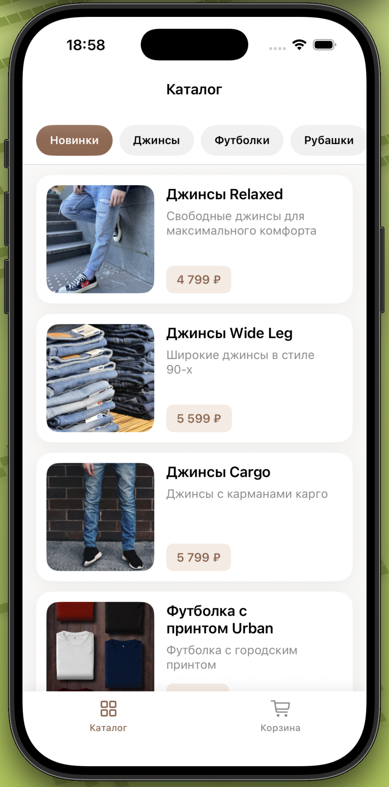
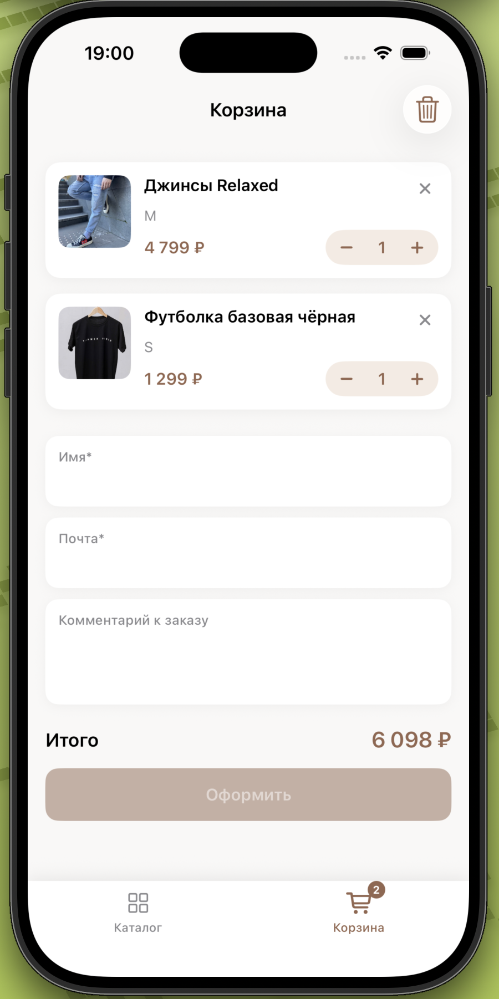
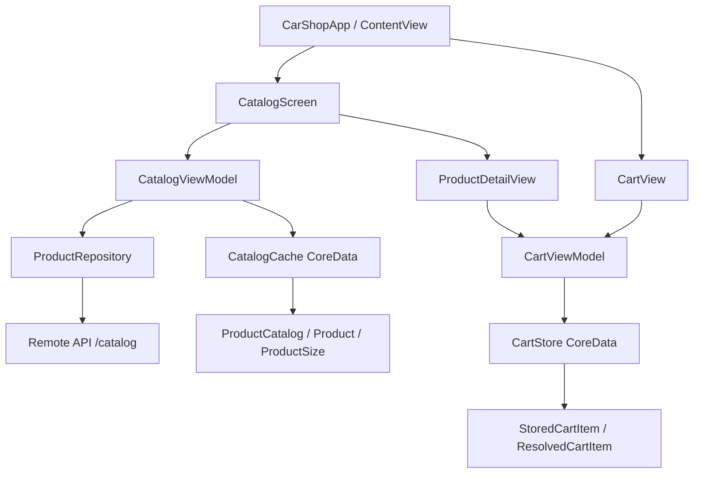

# CarShop

CarShop — учебное iOS-приложение интернет-магазина одежды для лабораторных работ FEIP FEFU Mobile Spring 2026.

Несмотря на историческое название проекта, текущая предметная область приложения — одежда: джинсы, футболки, рубашки, обувь и верхняя одежда. Каталог загружается только из API курса; после успешной загрузки ответ кэшируется в CoreData для offline-сценария.

## Команда

- Аленина Мария Алексеевна — iOS-разработчик
- Ли Елисей Владиславович — iOS-разработчик
- Петров Даниил Игоревич — iOS-разработчик

## Возможности

- Каталог товаров с категориями и отдельной вкладкой «Новинки».
- Загрузка каталога из API с bearer-токеном.
- Offline banner и отображение API-кэша через CoreData.
- Bottom sheet деталей товара: фото, теги, описание, выбор размера, материал, вес, сезон и страна производства.
- Корзина с бейджем, количеством, удалением, очисткой и общей стоимостью.
- Оформление заказа с валидацией имени и email.
- Локальное хранение корзины в CoreData: `productId`, `sizeId`, `quantity`.
- SwiftLint-конфигурация и unit-тесты на бизнес-логику.

## Скриншоты

| Каталог | Детали товара | Корзина |
| --- | --- | --- |
|  |  |  |

## Архитектура



Основной поток данных:

1. `CatalogViewModel` сначала пробует показать кэш, затем обновляет каталог из API.
2. `CatalogCache` хранит категории, товары, размеры и характеристики товара.
3. `ProductDetailView` добавляет выбранный размер в `CartViewModel`.
4. `CartStore` сохраняет только минимальные данные корзины, а отображение собирается из каталога.

## Сборка и запуск

Требования:

- macOS с полноценным Xcode;
- iOS Simulator;
- SwiftLint для локального линтинга.

Команды:

```bash
brew install swiftlint
swiftlint lint --config .swiftlint.yml

xcodebuild test \
  -project CarShop.xcodeproj \
  -scheme CarShop \
  -destination 'platform=iOS Simulator,name=iPhone 16,OS=latest' \
  CODE_SIGNING_ALLOWED=NO

xcodebuild build \
  -project CarShop.xcodeproj \
  -scheme CarShop \
  -destination 'generic/platform=iOS Simulator' \
  CODE_SIGNING_ALLOWED=NO
```

Через Xcode:

1. Открыть `CarShop.xcodeproj`.
2. Выбрать scheme `CarShop`.
3. Для запуска нажать `Run`.
4. Для тестов нажать `Product > Test`.

## Проверки качества

- Конфиг SwiftLint: `.swiftlint.yml`.
- Unit-тесты: `CarShopTests/CarShopTests.swift`.
- CI: `.github/workflows/ios.yml` запускает SwiftLint, unit-тесты и сборку.
